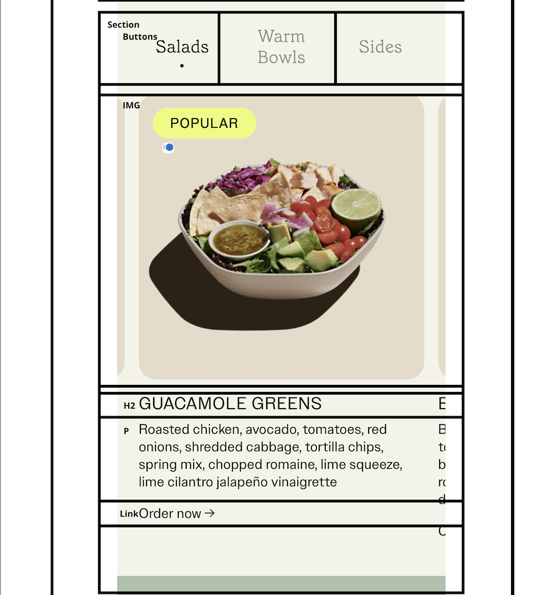
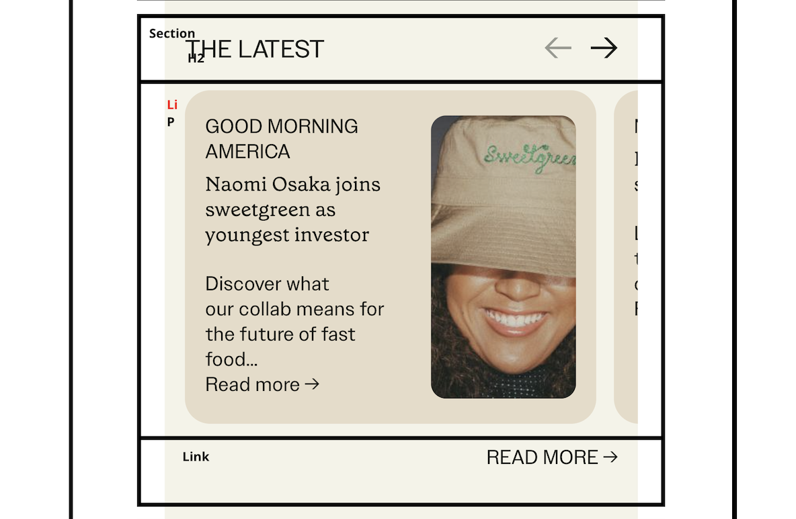
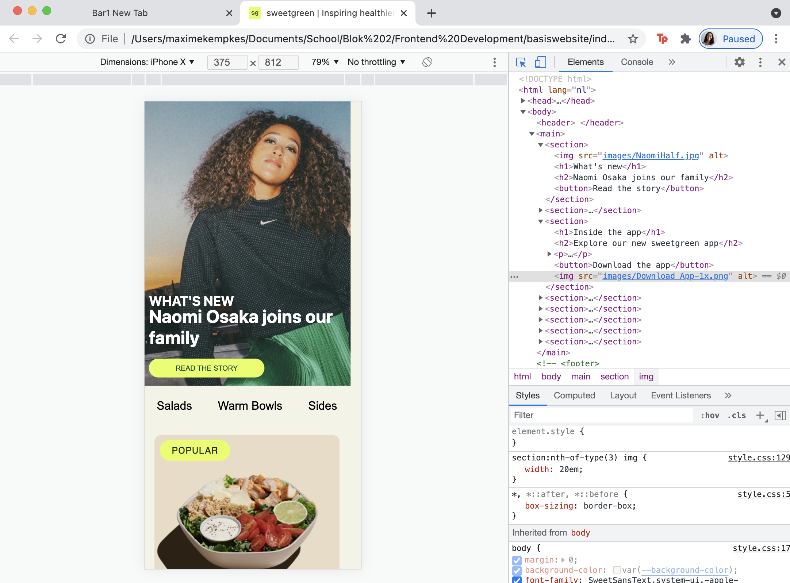
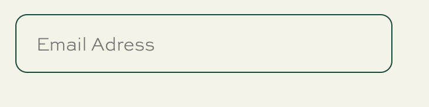
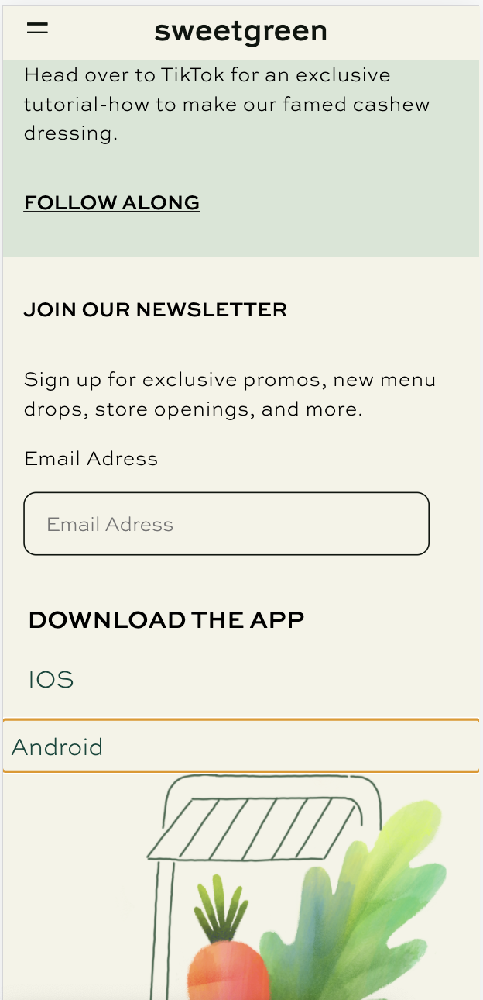
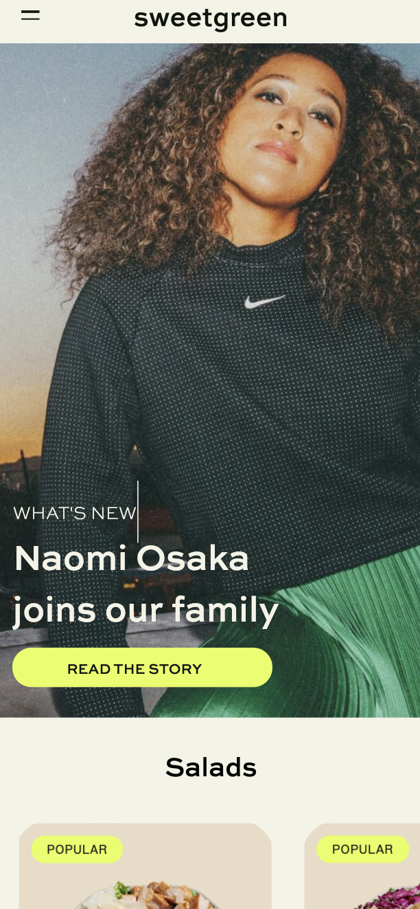
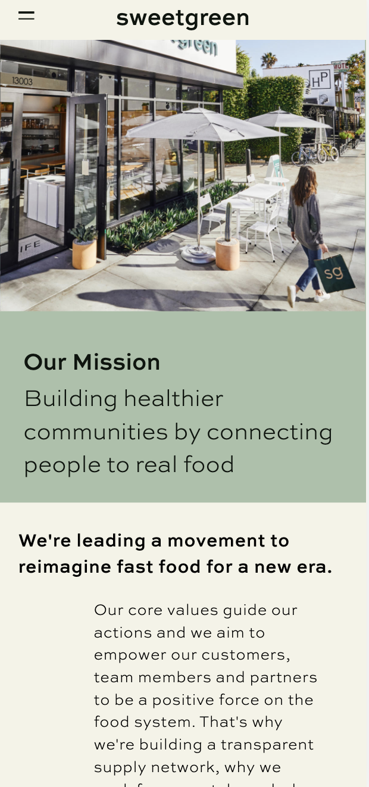

# Procesverslag

Markdown is een simpele manier om HTML te schrijven.  
Markdown cheat cheet: [Hulp bij het schrijven van Markdown](https://github.com/adam-p/markdown-here/wiki/Markdown-Cheatsheet).

Nb. De standaardstructuur en de spartaanse opmaak van de README.md zijn helemaal prima. Het gaat om de inhoud van je procesverslag. Besteedt de tijd voor pracht en praal aan je website.

Nb. Door _open_ toe te voegen aan een _details_ element kun je deze standaard open zetten. Fijn om dat steeds voor de relevante stuk(ken) te doen.

## Jij

uitwerken voor kick-off werkgroep

### Auteur:

Maxime Kempkes

#### Je startniveau:

Blauw

#### Je focus:

Surface 

## Je website

uitwerken voor kick-off werkgroep

### Je opdracht:

https://www.sweetgreen.com

#### Screenshot(s) van de eerste pagina (small screen):

Home

#### Screenshot(s) van de tweede pagina (small screen):

Menu

## Breakdownschets (week 1)

uitwerken na afloop 2e werkgroep

### de hele pagina:

### dynamisch deel (bijv menu):

### wellicht nog een dynamisch deel (bijv filter):

## Voortgang 1 (week 2)

uitwerken voor 1e voortgang

### Stand van zaken

Ik ben de afgelopen weken veel bezig geweest met Frontend. Dit is helemaal niet erg want ik vind het leuk en had het natuurlijk verwacht. Omdat het weer een tijd geleden was dat ik had gecodeerd  duurde het wel weer even voordat ik er weer een beetje in zat. In het begin heb ik heel veel zitten uitproberen. Meerdere keren de hele site verwijdert en opnieuw begonnen. Dit komt omdat ik heel visueel ben. Bepaalde onderdelen duurde daarom ook langer dan nodig was. Ik wilde dan dat het er gelijk op de website lijkt die ik aan het nacoderen ben maar dat is niet realistisch. Ik heb dat gelukkig los kunnen laten. Nu gaat het beter..het begint ook een beetje op de website te lijken maar er moet nog aardig wat aan gedaan worden.  Ik heb ook al een aantal pogingen gedaan om een responsive menu te maken maar dat lukte nog niet. Maar dat komt zeker goed. 
  
  

### Agenda voor meeting

samen met je groepje opstellen

| student 1: Maxime   | student 2: Donna      | student 3: Angelo    | student 4: Rick        | student 4: Tatum        |
| --------------------| ----------------------| ---------------------| -----------------------|-------------------------|
| gaat goed alleen    | moeite met het vak    | css werkt            | moeite en loop achter  |nog niet waar ik tegen   |
| de h1 en h2         | loop een beetje achter| niet via             | maar voorderest wel oke|aan loop maar loop wel   |
| pakken de font niet | hamburger bespreken   | github               |                        |achter                   |

### Verslag van meeting

De meeting was super waardevol. Ik had zelf niet veel waar ik tegenaan liep maar waar ik hulp nodig had werd ik geholpen dus dat is fijn. Kon daardoor ook makkelijk door.

- Goed bezig
- Geholpen met font-family
- Tips gekregen voor andere content
- Hulp hamburger menu

## Voortgang 2 (week 3)

uitwerken voor 2e voortgang

### Stand van zaken

Ik heb deze keer een hele grote sprint gemaakt..mijn eerste pagina is bijna af. Ik mis 1 onderdeel. Het is niet veel werk maar ik stel dat steeds uit. Ik heb al wat animaties verwerkt. Omdat mijn content op een mobiel wordt weergeven kan ik hover niet gebruiken dus ben ik aan het googlen hoe ik animaties zonder hover kan gebruiken. 
IK moet ook mijn code netjes maken. Op dit moment is het chaos en niet geordend. IK heb 1 onderdeel waar ik. Nu tegenaan loop en dat is dat mijn header niet een background-color wil pakken. 

 
  
### Agenda voor meeting

samen met je groepje opstellen

| student 1: Maxime      | student 2: Donna          | student 3: Angelo    | student 4: Rick        |student 4: Tatum        |
| -----------------------| --------------------------| ---------------------| ---------------------- |------------------------|
| gaat goed, alleen      | eerste pagina af          | nav verstoppen       |             ...        |Eerste pagina af, alleen|
| werkt  background-     | wel wat problemen met de  | animeren             | ...                    |responsive maken        |
| color nog niet         | tweede                    | spacing              | ...                    |Nog beginnen met 2e     |

### Verslag van meeting

Dit was de eerste keer dat we een voortgangsgesprek hadden met Vasilis. Hij was tevreden mte mijn werk en had aangegevn dat ik alvast aan de slag kon met de states..eerst wil ik mijn code op orde krijgen want op dit moment is het chaos.

- Code op orde krijgen
- Begin maken aan states
- Op zoek gaan naar uitdagingen

## Toegankelijkheidstest (week 4)

uitwerken na test in 8e voortgang

### Bevindingen

Toegankelijkheidstest

Tijdens de laatste werkgroep zijn we aan de slag gegaan met toegankelijkheid. 
In de werkgroep gaan we elkaars sites gebruiken en testen door onder andere een toegankelijkheidsbril. 

Screenreader
Voor de screenreader heb ik ook mijn scherm uitgeschakeld waardoor ik daadwerkelijk niks kon zien…Het navigeren naar de site was erg ingewikkeld en lukte uiteindelijk niet. Ik heb toen nog wel even gekeken hoe ik er kwam en heb het daarna wel met de screenreader gedaan. 

Wat mij opviel was dat hij letterlijk alles voorleest wat ik vervelend vond maar dat is natuurlijk essentieel. Ik was wel erg trots dat alle alt tags van de foto’s klopten.. Wel deed hij hij bij de tweede section het niet helemaal goed. Hij herhaalde de tekst 2 keer dus moet ik even kijken waar het verkeerd is gegaan. Ook las hij de label van de input niet op want die had ik niet en die wil ik wel toevoegen. Dus dat soort kleine elementen wil ik wel aanpassen.

Tab: Met de tab toets ging het navigeren wel maar niet heel soepel dus daar wil ik een keer naar kijken. Hij slaat af en toe elementen over en ik weet niet waarom die dat doet.

Elastiekjes: De site heeft niet hele kleine of onmogelijke knoppen dus het is gewoon te doen. Ook zijn er niet hele interactieve elementen..dus die heeft niet zoveel invloed.

Spasmes/Parkinson: Het is een vervelend gevoel maar ook dit is gewoon te doen. De website navigeren lukt ook gewoon…Hier weer niet heel veel interactieve elementen..

Gele lenzen: Hier is alles vooral te zien met een gele tint. Gelukkig hebben de kleuren niet veel invloed dus hier hoeven er geen aanpassingen te komen.

Blur/glare: Ik zie niks..of niet helemaal niets maar het is lastig. De grote headings zijn wel te zien maar ik kan niet alle headings veel groter doen. Want dan is er geen visuele onderscheidingen. De muis is moeilijk te zien dus is het wel fijn dat alles waar je overheen tovert groter wordt dus dit wil ik meer gebruiken

Low contrast: Lijkt blur veel op blur dus hier gelden dezelfde redenen en aanpassingen.

Hemi field: Geen last van..website is gewoon te navigeren. Duurt alleen wat langer..

Combined Loss Diabetic Eye Disease Peripheral field loss: Vervelend maar wel te doen..hier kost het toch meer tijd en aandacht.

Central field loss: Dit vind ik wel erg lastig . Ik zou niet gelijk weten hoe ik dit kan oplossen maar wil wel kijken hoe dit zou kunnen.

Ballon: Het was in principe gewoon te doen want er zijn niet hele drukke elementen op de site maar de label element wil ik wel aanpassen bij de form. Maar dit wilde ik al doen na de screenreader.

Conclusie & aanbevelingen
Over het algemeen heel veel geleerd en ook veel wat ik wil geen aanpassen. Ik wil vooral de kleine elementen waar je zelf snel overheen kijkt als je geen beperking hebt. Na de les heb ik toch nieuwe inzichten waar ik dan echt naar wil kijken. Ik ga ook wat research doen online hoe ik me beter kan verdiepen.
Maar de concrete aanbevelingen zijn:
- Label bij formulieren
- Duidelijke states
- Dikkere font weight
- Grote buttons

#### Label bij formulieren

Tijdens de toegankelijkheid testen viel het mij op dat tijdens de screenreader dat ik ging label had bij mijn input.Als ik wil dat iedereen gebruik kan maken van de site moet hier verandering in komen.

Dit is makkelijk opgelost..ik moet een label toevoegen.
  
   

#### Duidelijke states

Ik had verschillende states ontworpen maar die waren niet duidelijk genoeg.

Ik ga op zoek naar andere websites en kijken hoe zij dit aanpakken want ik vind het lastig om goede states te ontwerpen waar iedereen gebruik van kan maken.
  
  

#### Button en font

De website was te navigeren maar het kon iets beter. Met name de tekst dikte en knop grote.

Ik ga hiervoor gewoon een grotere padding toevoegen en een dikkere font weight.

## Voortgang 3 (week 4)

uitwerken voor 3e voortgang

### Stand van zaken

Laatste keer met student assitenten..de website is zo goed als klaar maar er waren nog kleine dingen waar ik hulp voor nodig had. Ik heb een lijstje gemaakt zodat het duidelijk was voor hun wat ik wilde. Ik wil ook advies vragen want heb het idee dat mijn website niet goed genoeg is.
  
### Agenda voor meeting

samen met je groepje opstellen

| student 1: Maxime      | student 2: Donna          | student 3: Angelo    | student 4: Rick        |student 4: Tatum        |
| -----------------------| --------------------------| ---------------------| ---------------------- |------------------------|
| vraag over header      | loop niet vast maar moet  | ...                  |             ...        |twee pagina's af, loop  |
| cards en optimaliseren | naar focus state kijken   |                      |                        |nergens tegen aan       |

### Verslag van meeting

Er waren vrij weinig vragen..alleen Donna en ik hadden hulp nodig en die hadden we gekregen. Ik kon daarmee goed op weg en kon aan de slag met de laatste dingen voor de deadline.
  
- Alle vragen beanwtoord
- Kon door met de opdracht

## Eindgesprek (week 5)

uitwerken voor eindgesprek

### Stand van zaken

Laatste paar dagen voor de deadline waren toch nog stressvol. Ik heb nog hulp in moeten schakelen van de student-assitent wat ik enorm waarderde. Ik was eigenlijk op zaterdag klaar maar had het idee dat de site niet goed genoeg was. Maar alles wat er in moest zitten zit er in..ook heb ik nog wat extra's toegevoegd. Ik was zelfs begonnen met een derde pagina waar ik na de deadline mee aan de slag ga. Ik vond het echt een leuke opdracht. Als we meer tijd hadden denk ik dat we nog meer hadden kunnen leren en doen maar ik ben op zich wel trots op het resultaat.
  
### Screenshot(s)

  
  
  

## Bronnenlijst

continu bijhouden terwijl je werkt

1. https://www.youtube.com/watch?v=yCyD5AZegLk
2. https://codepen.io/denic/pen/GRoOxbM?editors=0100
3. https://codepen.io/robinrendle/pen/wvaxEMz
4. https://www.w3schools.com/howto/howto_css_flip_card.asp
5. https://codepen.io/SamSloot/pen/MWEYwOB

